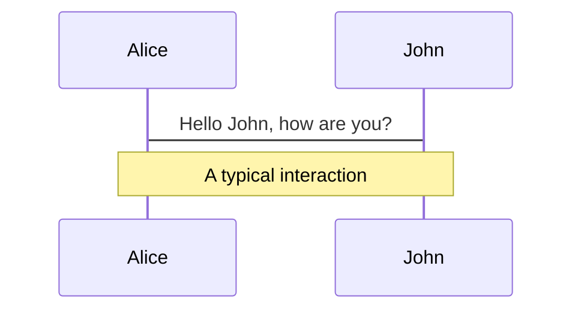
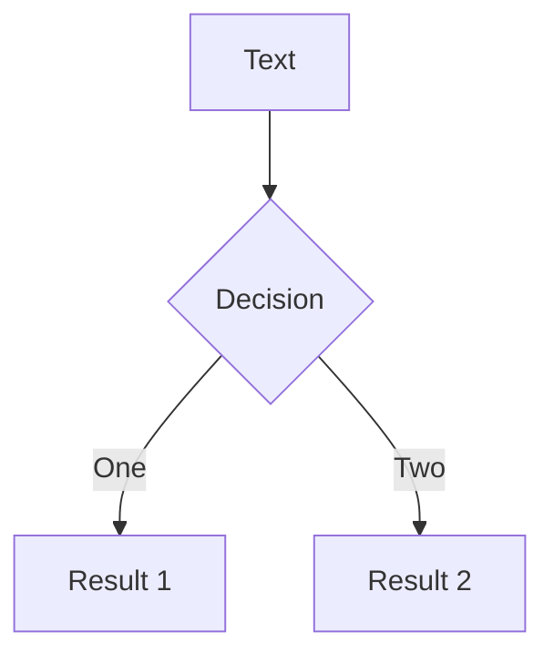
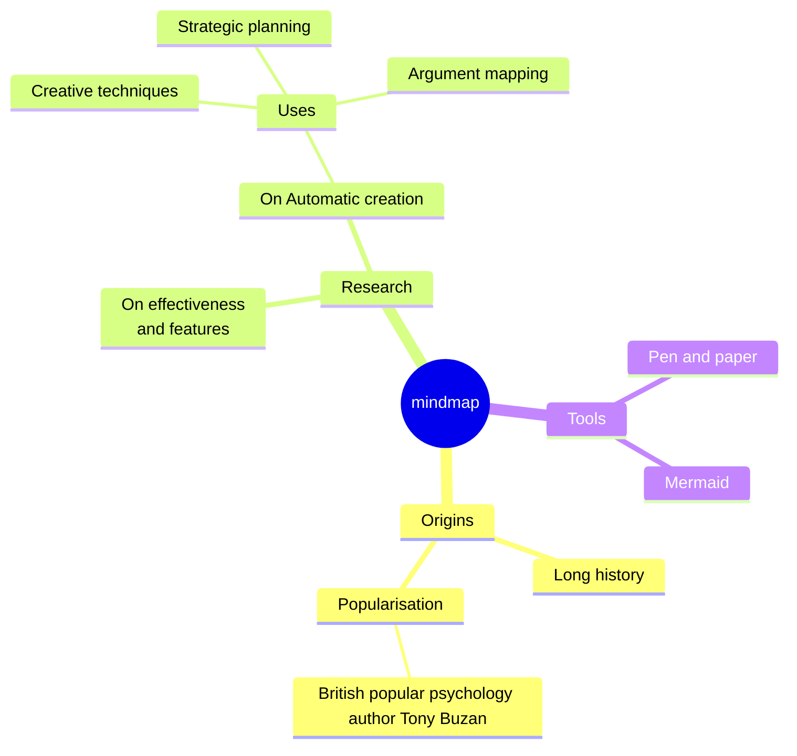
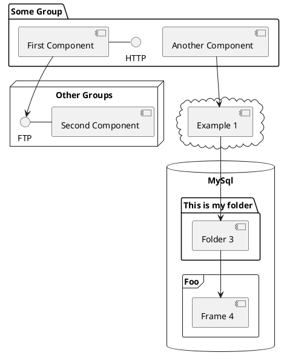

# Excited Developer Syndrome

Evan Kohilas

@ekohilas - `nohumanerrors.com`

<!--
TODO: ...

Hello Everyone!
-->

---

# Excited Developer Syndrome

<!--
TODO: Add giggle gif/image e.g. https://www.youtube.com/watch?v=dgzyorveKJc

Are you...
excited...
to be here?
-->

---
duration: 5min
---

# Excited Developer Syndrome

<!--
Okay great then we're off to a good start!

So today I want to talk about a phenomenon I'm coining "Excited Developer Syndrome"

And instead of giving you a boring definition

We'll start with an example

a story

of a developer named alex

are there any alex's here?

oh no...

Okay we'll start with the story

of a developer named ash

Ash was an amazing programmer. Not only because they knew all their fundamentals.

But they were a quick learner, and loved learning new things! 

And whenever they were bored with the status quo, they'd look up the latest trends and cool technologies.

The week Ash joined their new team, they were quickly able to finish their first ticket.

But Ash wasn't just a good learner.

They also had sparks of curiosity.

By the end of their first month, they had questioned, and were able to identify multiple problems the company was facing.

But Ash wasn't a complainer

They knew that solutions spoke louder than problems.

And Ash was good at building out solutions, and doing so quickly.

Now can I get a show of hands for who can relate to Ash?

Okay about X of you.

What about someone who knows of someone like Ash?

Okay about Y of you.

Ash was doing quite well. In fact, so well that it didn't make sense for them to stay where they were.

Throughout their career, Ash would get promoted, change teams, change companies, become a manager.

Which was great news for Ash!

But this was a problem because, inevitably, Ash will now have less time, and move further and further away from what they had built.

Having handed over their work, they would no longer be responsible for the code and technical debt they had written, which would be a pain to fix when it fails.

They'll no longer be around to see where their choice of new technology is failing, how things are incorrectly used, or where they should have been improved.

And in their excitement to build out solutions to all the problems that they thought they saw,

They never really stopped to fully understand the problem at hand, or to deeply investigate why things were the way they were, and maybe realise that the best solution didn't require new code at all.

And this is not uncommon.

Can I get a show of hands, if you can still relate to Ash, or met someone like them?

That's still quite a lot of you...

This is the "Excited Developer Syndrome"

# TODO: Refine definition?

A developer, who is excited for building out quick solutions, before fully understanding the problem at hand, and thus often become unmaintainable out of not retaining responsibility. 

Now given that so many of you can relate to the "Excited Developer Syndrome", that is so prevalent within our industry, where building becomes easier by the day, what can one do to prevent it, to stop it from happening to us?

# TODO: Link to other sources
# TODO: Add clarity when it's the right mindset to have
-->

---
duration: 9.5min
---

<!--
The first thing would be to think about existing solutions.

# TODO: Title the phrase below 

Your proposal (to an existing solution) is not unique.

But how can I make this claim when there's over 8 billion minds on this earth?

Well, it's because of two phenomenon.

The first is the Law of truly large numbers.

Not to be confused with the law of large numbers, which says that if I take the average of all of your guesses for how many ...

The law of *truly* large numbers effectively states that the chance for a 1 in a billion event to happen more than once across 8 billion people is 99.96%

The second phenomenon is simultaneous invention.

Raise your hand if you knew that the Telephone was also invented and had a patent submitted by Elisha Gray on the same day.

Alexander Bell's only became known because his lawyers paid the fees immediately.

Raise your hand if you knew that Henri Poincare also invented E=mc2, and that Einstein only provided the accepted interpretation.

Or if you knew that the Turing Machine was also proposed in the same year independently by Emil Post

My favourite one, RSA was described 4 years earlier by Clifford Cocks, who couldn't say anything because he was working for UK's intelligence agency.

So we have this combination of phenomenon, where one says that a solution already exists, and the other, that it's hidden or hard to find.

And I'm sure you've come across this in your daily life.

Have you ever searched for something on Google, to surprisingly (and seemingly) get no results?

Every time I come across this, I definitely don't take absence as the answer.

# TODO: Show un-indexed project

Many things, like software projects deep within GitHub aren't or can't be indexed.

# TODO: Show google search example

Or, they're a needle in the haystack of hundreds of fake pages exploiting the search engine optimization algorithm (or SEO).

So my advice here is to get creative.

Don't just rely on Google.

Try other search engines.

Search GitHub, and other code repositories (and note that GitLab requires you to log in...)

For example, I've found tools for GitLab to only exist on GitHub.

Or if there's still not results, try using an LLM's deep research, which is helpful in bypassing SEO bloat, and understanding the underlying intent of your words.

In either case, be wary of Type 2 errors. 

A Type 2 error is like a faulty COVID test that says you don't have COVID.

Just because you got no results, doesn't mean it doesn't exist. 

These tools aren't sources of truth.

Because these tools can't find what hasn't been made public.

For example, a show of hands from anyone whose made a tool at work that you couldn't share, or a personal tool that you didn't get around to sharing, or were comfortable making public? 

That's about X of you, and if you consider that this is a conference about Open Source, the reality is probably less!

And I bet that if we all talked to each other, there'd be at least one of you who was looking for a solution, and another who had already built it.
-->

---

<!--
I'd also gamble that on multiple occasions, someone like Ash _did_ find a solution but decided not to use it.

Why?

Ash was likely a victim of Not Invented Here, a bias against ideas from the outside.

And empirically you don't want this bias, because a 1982 study by Ralph Katz and Thomas J. Allen shows that it causes performance to decline.

But I've seen too many companies decide to re-build solutions in house, for solutions that exist as paid, managed products.

From simple feature flagging software,

To Chat-GPT.

So perhaps these companies don't agree, or their team's performance is not an issue.

Maybe they really care about keeping their data in house for security.

Or they don't want to have yet another dependency that could fail and be out of their control.

Or maybe they want customizability that the off the shelf product can't offer.

Or worst of all, Ash wanted something complex to build for a promotion.

I'm not going to argue that these aren't valid reasons. They definitely have their place.

# TODO: Looking eyes fading in.

(Okay maybe I'll argue against the last one)

But they are all tradeoffs, and we have to consider.

Are these benefits worth the cost? 

Is keeping data in house that important, when everyone is communicating through tools like Slack, or using external unknown tools like their personal LLM?

Are dependencies that concerning, if the internal infrastructure would be less stable?

Is that one extra feature worth the additional complexity?

Or is building out an entire new promotion worthy product worth the maintenance burden?

And if the answer to some of these questions is yes, then that's perfectly fine!

What's more important is that they've been thought of.

Because building takes time, and time is money.

A team being dedicated to build, maintain, debug, and secure, a product like feature flags, can cost on the order of a million dollars a year.

Or, if you had 1 million users, it would cost around 1/8th of that to pay for a product.

Which don't forget, is run by a team whose sole job is managing the reliability and security of this product.

I can't really blame Ash for being a victim to Not Invented Here This bias exists because the nature of our industry encourages it.

I mean, can you imagine working in an industry like construction, where timelines are on the order of years? 

In comparison, software engineering is blessed with the ability to iterate quickly, through building, testing, and validating ideas, and personally I can't give that up.

And with the advent of generative AI, that produces code better by the day, we can't expect this bias to go away.

It's now easier than ever for someone to come up with an idea, and get to a working solution faster than they could find and integrate and existing one, because they've decided they can do a better job re-building it with the help of AI.

# TODO: Shrug emoji.

And I can't really stop that.

But I have experienced where that can go wrong.

# TODO: Add example

So if we do go down the route of re-building

These tools that help us build quicker make it easy to do so with less thinking.

So we must remind ourselves that whatever is built is likely half complete, and can't just be called done.


-->

---
duration: 2min
---

<!--

# TODO: Use Ash instead of you?

But what if you've found something that's free and open source?

That's great!

But there's a problem.

Maybe it's broken, or it's not quite what you're looking for.

# TODO: Insert XKCD another standard meme

Before you go and make the XKCD standards meme more true, have you considered:

Contributing back to fix it?

Submitting a PR will likely not only take less time than starting from scratch, but also make the solution more useful for everyone else!

Which in turn, makes the solution more popular,

and thus, becomes a compounding investment in the project's success and sustainability.

But maybe a PR doesn't make sense.

Maybe the change is too different for the project.

Or maybe the author doesn't want to accept it.

Then before starting from scratch, consider making your changes on a fork!

This will not only be a time save for you, but also anyone else who follows your path.

Even if you don't want the work to be public, you'll still save yourself time, especially if the upstream project makes changes that you could merge and benefit from.

But if you're adamant that you must start from scratch, that's fine too.

And it's okay not to like something or not have the time.

Like, it's not always the case that fixing a bug will be easier than starting from scratch.

At the end of the day, there's nothing that can force you to make these choices. They have to come from within.

And if it does pain you to create another standard, I do encourage you to at least leave some feedback, or a trail, for others who search to find your path.

-->

---
duration: 1min
---

<!--

What if you've honestly searched everywhere. Across different search engines, hosted code platforms, and have asked AI _and_ your network. What if you've basically scoured the earth but still couldn't find anything?

Then don't let me stop you!

Go forth and build!

But I hope you'll do so with a new frame of mind, so that tomorrow, when Ash thinks about building the same thing, they'll quickly discover your work, and maybe, your work will be inspiring enough for them to contribute back and improve upon your work, rather than decide to start from scratch, and build something internally that will never see the light of day.

-->

---

<!--
But wait, should you actually build it?

# TODO: Title

Think about the system

This is a question we often don't get to ask in our excitement.

# TODO: Can I incorporate a single example as the main thread?

If we pause for a moment, breathe, look around us, and remove the blinders of excitement, then we could ask, what is the underlying system that we see at play?

-->

---

<!--

This is one of the core principles that Donella Meadows highlights in her book "Thinking in Systems"

She gives the example of the late 1900's Canadian lumber industry which would harvest Spruce and Fir trees.

However, they had a problem, the Budworm pest, which would kill these trees.

So over 30 years, they sprayed pesticides.

Each year became more and more expensive, and by 1980, they had spent an unmanageable 12.5 million in that year alone.

Why was this considered unmanageable?

Well after 30 years of spraying, the Budworm was still killing as many as 20 million hectares of trees per year.

It wasn't until two Ecology and Forestry researchers built a computer model to get a whole system look, that they discovered that the Budworm wasn't a pest.

The Budworm was an important element of the ecosystem. 

Without the Budworm, these forests would become a monoculture of Fir, which was the Budworm's favourite food.

And these pesticides, would not only increase the Budworm's food supply, but also it's predators, which where there to keep it in check from exploding in an uncontrollable manner.

-->

---

<!--

If we extrapolate this example into the world of software, it'd be like 

when we waste time in every review on nits.

If we stop to analyse the system, we could realise that, they could be accepted as being inevitable. 

Maybe that's not an answer, because like Budworms, too many nits can affect the final product.

And instead it's worth taking a different approach, like changing the tree harvesting strategy, or like adding lint rules to stop nits from getting to a review in the first place.

# TODO: Are the other examples better?

wasting time in every review on nits, instead of adding lint rules to stop them from getting to the review in the first place.

continuously trying to fix a flakey test that keeps popping up, instead of thinking about whether the test is needed in the first place.

continuously trying to fix flakey tests, instead of building around the fact that they're inevitable 
expect that flakey tests will happen, and write tools to track them?

-->

---

<!-- 

# TODO: Title

Nothing, is infinitely better than something.

A real scenario that a developer came across (and almost became an Ash) was when they were working on a country wide High Frequency network.

The network was built to communicate between a source and destination.

And it had to ensure that it was doing so with the best signal.

Because when you're sending over a High Frequency, there can be a lot of noise and interference.

So the network had been built so that on every transmission, it would predict what configuration would produce the best signal.

It would predict this configuration by running calculations on things like the state of the ionosphere,

the type, location, and orientation of the source and destination antennas.

And after making this prediction and transmission, it could compare the signal quality against the prediction. 

Now this network was fully functional and battle tested.

But this developer was given a feature request.

Given they know what state produces a good signal quality.

It should be cached, so they don't have to run these expensive calculations. 

Now a cache is not exactly a difficult implementation.

But this developer, having built out, and having a deep understanding of the system, decided to think about it.

And they realised that the cache would need:

The transmission frequency

The transmitter power, antenna type, orientation, and location of the source antenna.

The transmitter power, antenna type, orientation, and location of the destination antenna.

(Side note, countries are quite big)

But did that matter, if calculating the state of the ionosphere needed:

The time of day,

The time of year,

And where you are in the the 11 year solar cycle?

Effectively making the cache only useable once every 11 years

If at all, considering how many things change in a decade.

I don't blame whoever had suggested the feature.

On the surface it was a perfectly reasonable idea

And it's in our human nature to want to improve things.

To me, it shows the importance of having a good understanding of the system.

The ability to apply critical thinking, before excitedly rushing to a what would have been an easy implementation that would have no effect. 

-->

---

<!--

There's this meme that I love.

# TODO: Insert meme

The dev on the left of the bell curve uses the built in sort function to sort a list.

The average dev implements their own sort function with some tests. 

The dev on the right, uses the built in sort function and doesn't write tests because it's the built in sort.

And the dev on far right tail end, removes the sort function because the list was already sorted.

And I think that love this meme because you can apply it to anything.

Similarly, one of my favourite quotes: 

"[Instead of thinking] How can I make this engineering process faster, maybe look at how you can get rid of whatever it is completely"

Instead of thinking, how can I fix this flakey test, maybe look at what value that test is providing in the first place.

Removing that test, that process, that would now no longer provide value, is infinity more valuable than perpetually spending time fixing it.

But that's not possible if you don't truly understand the system.

-->

---

<!--

One way to think about the system is to bias for inaction.

Don't just build what you're told.

Question the why, to help you understand the underlying problem.

Use the 5 whys technique to drill in.

We'll keep asking why to figure out what we're really trying to solve.

And we'll bring Ash back, to put this into perspective.

# TODO: Remove the asking?

Ash was asked to build a past uploads screen.

A screen where users could see all their past uploads, so that they could easily find and embed a previously uploaded file, without having to re-upload it.

# TODO: Better name for the requestor

Requestor: We need to build a past uploads screen!

Why #1

Ash: Why do we need to build a past uploads screen?

Requestor: So users can quickly upload previous files served from a thumbnail service.

Why #2

Ash: Why do we need a thumbnail service?

Requestor: To generate and serve thumbnails for past uploads.

Why #3

Ash: Why do we need thumbnails for past uploads, could we use the original images instead?

Requestor: Well, if we did that, users would be making too many large requests.

Why #4

Ash: Why would users be making large requests?

Requestor: Well, if they have a lot of past uploads. Especially if each one is megabytes in size!

Why #5

Ash: Why would users have a lot of past uploads? How many users have more than 2 past uploads?

Requestor: Uh, let me check... Yeah right now, zero.

With this questioning, Ash was able to avoid building out an entire feature which would have had no users.

# TODO: Rephrase "if asked ...?"

If these questions are asked in a respectful manner, it can't hurt.

In fact it'll help you to understand the value to the customer, so that you're closer to the problem at hand.

And the request doesn't have to be entirely ignored either. Because in reality, it is a valid request!

Ash: I do see your concern. What do you think about keeping a track of that metric, and re-evaluating it when it starts to affect more users? 

This is data driven design, and it is too often ignored.

Which is a shame because we're an industry that can utilise it so quickly and effectively.

Because otherwise, the alternative looks like:

Weeks of:

Engineering time spent on implementing additional complexity, and testing that the spec was followed.

Only to be followed by the inevitable burden of keeping it maintained,

dealing with newly introduced bugs for users

and the dependency hell that all other developers now need to deal with, because this feature required installing a special package that now fails all new builds.

-->

---

<!-- 
What if you do have to build something?

# TODO: Title

Focus on the minimum

# TODO: simplicity staff engineer meme

-->

---
# What is Slidev?

Slidev is a slides maker and presenter designed for developers, consist of the following features

- 📝 **Text-based** - focus on the content with Markdown, and then style them later
- 🎨 **Themable** - themes can be shared and re-used as npm packages
- 🧑‍💻 **Developer Friendly** - code highlighting, live coding with autocompletion
- 🤹 **Interactive** - embed Vue components to enhance your expressions
- 🎥 **Recording** - built-in recording and camera view
- 📤 **Portable** - export to PDF, PPTX, PNGs, or even a hostable SPA
- 🛠 **Hackable** - virtually anything that's possible on a webpage is possible in Slidev
<br>
<br>

Read more about [Why Slidev?](https://sli.dev/guide/why)

<!--
You can have `style` tag in markdown to override the style for the current page.
Learn more: https://sli.dev/features/slide-scope-style
-->

<style>
h1 {
  background-color: #2B90B6;
  background-image: linear-gradient(45deg, #4EC5D4 10%, #146b8c 20%);
  background-size: 100%;
  -webkit-background-clip: text;
  -moz-background-clip: text;
  -webkit-text-fill-color: transparent;
  -moz-text-fill-color: transparent;
}
</style>

<!--
Here is another comment.
-->

---
transition: slide-up
level: 2
---

# Navigation

Hover on the bottom-left corner to see the navigation's controls panel, [learn more](https://sli.dev/guide/ui#navigation-bar)

## Keyboard Shortcuts

|                                                     |                             |
| --------------------------------------------------- | --------------------------- |
| <kbd>right</kbd> / <kbd>space</kbd>                 | next animation or slide     |
| <kbd>left</kbd>  / <kbd>shift</kbd><kbd>space</kbd> | previous animation or slide |
| <kbd>up</kbd>                                       | previous slide              |
| <kbd>down</kbd>                                     | next slide                  |

<!-- https://sli.dev/guide/animations.html#click-animation -->

<p v-after class="absolute bottom-23 left-45 opacity-30 transform -rotate-10">Here!</p>

---
layout: two-cols
layoutClass: gap-16
---

# Table of contents

You can use the `Toc` component to generate a table of contents for your slides:

```html
<Toc minDepth="1" maxDepth="1" />
```

The title will be inferred from your slide content, or you can override it with `title` and `level` in your frontmatter.

::right::

<Toc text-sm minDepth="1" maxDepth="2" />

---
layout: image-right
# remove random image for snapshotting
# image: https://cover.sli.dev
---

# Code

Use code snippets and get the highlighting directly, and even types hover!

```ts [filename-example.ts] {all|4|6|6-7|9|all} twoslash
// TwoSlash enables TypeScript hover information
// and errors in markdown code blocks
// More at https://shiki.style/packages/twoslash
import { computed, ref } from 'vue'

const count = ref(0)
const doubled = computed(() => count.value * 2)

doubled.value = 2
```

<arrow v-click="[4, 5]" x1="350" y1="310" x2="195" y2="342" color="#953" width="2" arrowSize="1" />

<!-- This allow you to embed external code blocks -->
<<< @/snippets/external.ts#snippet

<!-- Footer -->

[Learn more](https://sli.dev/features/line-highlighting)

<!-- Inline style -->
<style>
.footnotes-sep {
  @apply mt-5 opacity-10;
}
.footnotes {
  @apply text-sm opacity-75;
}
.footnote-backref {
  display: none;
}
</style>

<!--
Notes can also sync with clicks

[click] This will be highlighted after the first click

[click] Highlighted with `count = ref(0)`

[click:3] Last click (skip two clicks)
-->

---
level: 2
---

# Shiki Magic Move

Powered by [shiki-magic-move](https://shiki-magic-move.netlify.app/), Slidev supports animations across multiple code snippets.

Add multiple code blocks and wrap them with <code>````md magic-move</code> (four backticks) to enable the magic move. For example:

````md magic-move {lines: true}
```ts {*|2|*}
// step 1
const author = reactive({
  name: 'John Doe',
  books: [
    'Vue 2 - Advanced Guide',
    'Vue 3 - Basic Guide',
    'Vue 4 - The Mystery'
  ]
})
```

```ts {*|1-2|3-4|3-4,8}
// step 2
export default {
  data() {
    return {
      author: {
        name: 'John Doe',
        books: [
          'Vue 2 - Advanced Guide',
          'Vue 3 - Basic Guide',
          'Vue 4 - The Mystery'
        ]
      }
    }
  }
}
```

```ts
// step 3
export default {
  data: () => ({
    author: {
      name: 'John Doe',
      books: [
        'Vue 2 - Advanced Guide',
        'Vue 3 - Basic Guide',
        'Vue 4 - The Mystery'
      ]
    }
  })
}
```

Non-code blocks are ignored.

```vue
<!-- step 4 -->
<script setup>
const author = {
  name: 'John Doe',
  books: [
    'Vue 2 - Advanced Guide',
    'Vue 3 - Basic Guide',
    'Vue 4 - The Mystery'
  ]
}
</script>
```
````

---

# Components

<div grid="~ cols-2 gap-4">
<div>

You can use Vue components directly inside your slides.

We have provided a few built-in components like `<Tweet/>` and `<Youtube/>` that you can use directly. And adding your custom components is also super easy.

```html
<Counter :count="10" />
```

<!-- ./components/Counter.vue -->
<Counter :count="10" m="t-4" />

Check out [the guides](https://sli.dev/builtin/components.html) for more.

</div>
<div>

```html
<Tweet id="1390115482657726468" />
```

<Tweet id="1390115482657726468" scale="0.65" />

</div>
</div>

<!--
Presenter note with **bold**, *italic*, and ~~striked~~ text.

Also, HTML elements are valid:
<div class="flex w-full">
  <span style="flex-grow: 1;">Left content</span>
  <span>Right content</span>
</div>
-->

---
class: px-20
---

# Themes

Slidev comes with powerful theming support. Themes can provide styles, layouts, components, or even configurations for tools. Switching between themes by just **one edit** in your frontmatter:

<div grid="~ cols-2 gap-2" m="t-2">

```yaml
---
theme: default
---
```

```yaml
---
theme: seriph
---
```


</div>

Read more about [How to use a theme](https://sli.dev/guide/theme-addon#use-theme) and
check out the [Awesome Themes Gallery](https://sli.dev/resources/theme-gallery).

---

# Clicks Animations

You can add `v-click` to elements to add a click animation.

<div v-click>

This shows up when you click the slide:

```html
<div v-click>This shows up when you click the slide.</div>
```

</div>

<br>

<v-click>

The <span v-mark="{ at: 3, color: 'red', seed: 1 }"><code>v-mark</code> directive</span>
also allows you to add
<span v-mark="{ at: 4, color: 'orange', type: 'circle', seed: 1 }">inline marks</span>
, powered by [Rough Notation](https://roughnotation.com/):

```html
<span v-mark.underline.orange>inline markers</span>
```

</v-click>

<div mt-20 v-click>

[Learn more](https://sli.dev/guide/animations#click-animation)

</div>

---

# Motions

Motion animations are powered by [@vueuse/motion](https://motion.vueuse.org/), triggered by `v-motion` directive.

```html
<div
  v-motion
  :initial="{ x: -80 }"
  :enter="{ x: 0 }"
  :click-3="{ x: 80 }"
  :leave="{ x: 1000 }"
>
  Slidev
</div>
```

<div class="w-60 relative">
  <div class="relative w-40 h-40">
    
    
    
  </div>

  <div
    class="text-5xl absolute top-14 left-40 text-[#2B90B6] -z-1"
    v-motion
    :initial="{ x: -80, opacity: 0}"
    :enter="{ x: 0, opacity: 1, transition: { delay: 2000, duration: 1000 } }">
    Slidev
  </div>
</div>

<!-- vue script setup scripts can be directly used in markdown, and will only affects current page -->
<script setup lang="ts">
const final = {
  x: 0,
  y: 0,
  rotate: 0,
  scale: 1,
  transition: {
    type: 'spring',
    damping: 10,
    stiffness: 20,
    mass: 2
  }
}
</script>

<div
  v-motion
  :initial="{ x:35, y: 30, opacity: 0}"
  :enter="{ y: 0, opacity: 1, transition: { delay: 3500 } }">

[Learn more](https://sli.dev/guide/animations.html#motion)

</div>

---

# $\LaTeX$

$\LaTeX$ is supported out-of-box. Powered by [$\KaTeX$](https://katex.org/).

<div h-3 />

Inline $\sqrt{3x-1}+(1+x)^2$

Block
$$ {1|3|all}
\begin{aligned}
\nabla \cdot \vec{E} &= \frac{\rho}{\varepsilon_0} \\
\nabla \cdot \vec{B} &= 0 \\
\nabla \times \vec{E} &= -\frac{\partial\vec{B}}{\partial t} \\
\nabla \times \vec{B} &= \mu_0\vec{J} + \mu_0\varepsilon_0\frac{\partial\vec{E}}{\partial t}
\end{aligned}
$$

[Learn more](https://sli.dev/features/latex)

---

# Diagrams

You can create diagrams / graphs from textual descriptions, directly in your Markdown.

<div class="grid grid-cols-4 gap-5 pt-4 -mb-6">









</div>

Learn more: [Mermaid Diagrams](https://sli.dev/features/mermaid) and [PlantUML Diagrams](https://sli.dev/features/plantuml)

---
foo: bar
dragPos:
  square: 691,32,167,_,-16
---

# Draggable Elements

Double-click on the draggable elements to edit their positions.

<br>

###### Directive Usage

```md

```

<br>

###### Component Usage

```md
<v-drag text-3xl>
  <div class="i-carbon:arrow-up" />
  Use the `v-drag` component to have a draggable container!
</v-drag>
```

<v-drag pos="663,206,261,_,-15">
  <div text-center text-3xl border border-main rounded>
    Double-click me!
  </div>
</v-drag>


###### Draggable Arrow

```md
<v-drag-arrow two-way />
```

<v-drag-arrow pos="67,452,253,46" two-way op70 />

---
src: ./pages/imported-slides.md
hide: false
---

---

# Monaco Editor

Slidev provides built-in Monaco Editor support.

Add `{monaco}` to the code block to turn it into an editor:

```ts {monaco}
import { ref } from 'vue'
import { emptyArray } from './external'

const arr = ref(emptyArray(10))
```

Use `{monaco-run}` to create an editor that can execute the code directly in the slide:

```ts {monaco-run}
import { version } from 'vue'
import { emptyArray, sayHello } from './external'

sayHello()
console.log(`vue ${version}`)
console.log(emptyArray<number>(10).reduce(fib => [...fib, fib.at(-1)! + fib.at(-2)!], [1, 1]))
```

---
layout: center
class: text-center
---

# Learn More

[Documentation](https://sli.dev) · [GitHub](https://github.com/slidevjs/slidev) · [Showcases](https://sli.dev/resources/showcases)

<PoweredBySlidev mt-10 />
