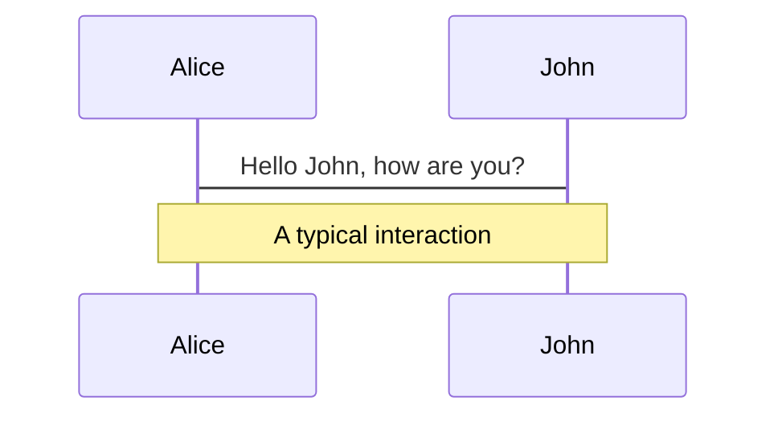
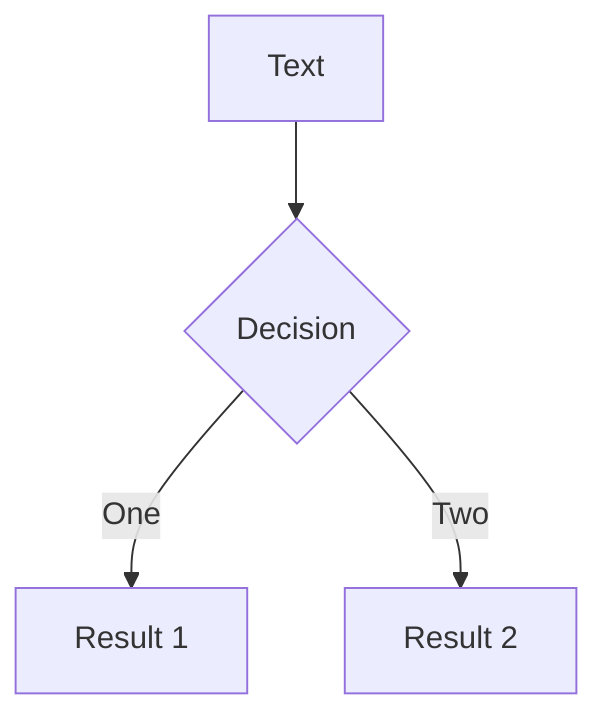
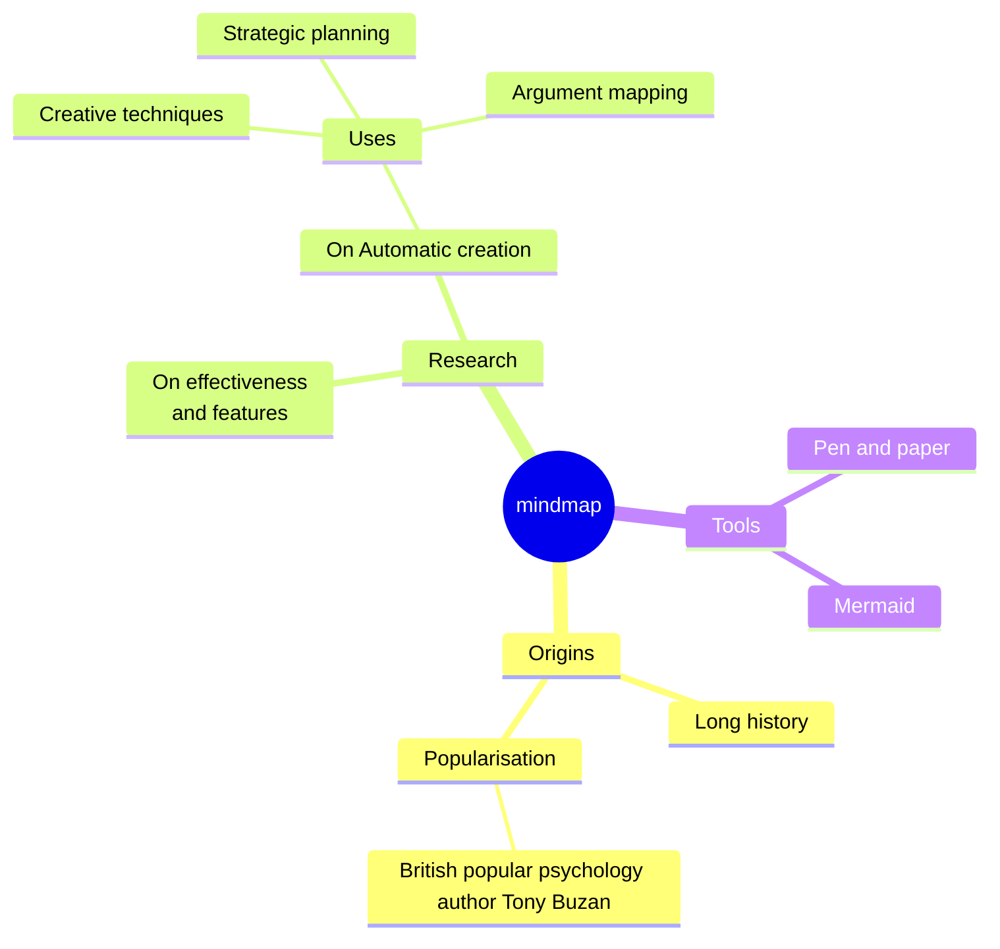
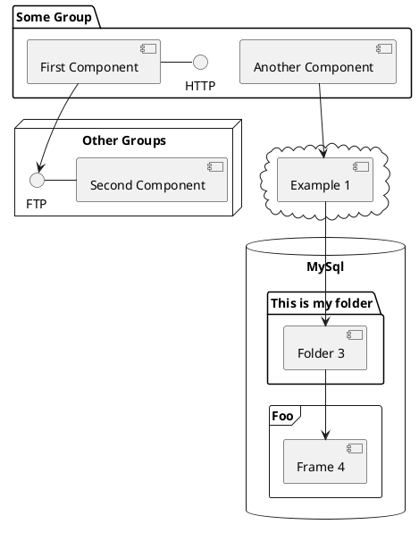

# Excited Developer Syndrome

## Evan Kohilas

#### @ekohilas - nohumanerrors.com

<style>
h1 {
  @apply mb-10;
}
h2 {
  @apply text-2xl; 
}
h4 {
  @apply font-mono mt text-2xl;
}
</style>

<!--
TODO: ...

Hello Everyone!
-->

---
layout: statement
---

# Excited Developer Syndrome

## Evan Kohilas

#### @ekohilas - nohumanerrors.com

<style>
h1 {
  @apply mb-10;
}
h2 {
  @apply text-2xl; 
}
h4 {
  @apply font-mono mt text-2xl;
}
</style>

<!--
Are you...
-->

---
layout: statement
---

# Excited [Developer Syndrome]{style="opacity:50%"}

## Evan Kohilas

#### @ekohilas - nohumanerrors.com

<style>
h1 {
  @apply mb-10;
}
h2 {
  @apply text-2xl; 
}
h4 {
  @apply font-mono mt text-2xl;
}
</style>

<!--
excited...
to be here?
-->

---
layout: image
image: /ron_giggle_parks_and_rec.webp
---

<!--
Okay great then we're off to a good start!
-->

---
duration: 5min
title: Introduction
layout: statement
---

# Excited Developer Syndrome

<!--
So today I want to talk about a phenomenon I'm coining "Excited Developer Syndrome"
-->
---
layout: statement
---

# Excited Developer Syndrome

***noun*** 

## _Definition:_ ...

<!--
And instead of giving you a boring definition
-->

---
layout: image
image: /story.svg
---

<!--
We'll start with an example

a story
-->

---
layout: image
image: /dev.svg
---

<!--
of a developer named alex

are there any alex's here?

oh no...

Okay uh we'll start with the story

of a developer named ash

(If your name is Ash, I'm sorry, but the story must go on.)
-->

---
layout: image
image: /dev_amazing.svg
---

<!--
Ash was an amazing programmer.

Not only because they knew all their fundamentals.
-->

---
layout: image
image: /dev_learn.svg
---

<!--
But they were a quick learner, and loved learning new things! 
-->

---
layout: image
image: /dev_bored.svg
---

<!--
And whenever they were bored with the status quo
-->

---
layout: image
image: /dev_cool.svg
---

<!--
they'd look up the latest trends and cool technologies.
-->

---
layout: image
image: /dev_strong.svg
---

<!--
The week Ash joined their new team, they were quickly able to finish their first ticket.
-->

---
layout: image
image: /dev_think.svg
---

<!--
But Ash wasn't just a good learner.

They also had sparks of curiosity.

By the end of their first month, they had questioned, and were able to identify multiple problems the company was facing.
-->

---
layout: image
image: /dev_angry.svg
---

<!--
But Ash wasn't a complainer

They knew that solutions spoke louder than problems.
-->

---
layout: image
image: /dev_fast.svg
---

<!--
And Ash was *good* at building out solutions

and doing so quickly.
-->

---
layout: image
image: /hand.svg
---

<!--
Now can I get a show of hands for who can relate to Ash?

Okay about X of you.

What about someone who knows of someone like Ash?

Okay about Y of you.
-->

---
layout: image
image: /dev_party.svg
---

<!--
Ash was doing quite well. In fact, so well that it didn't make sense for them to stay where they were.

Throughout their career,

Ash would get promoted, for integrating that cool new technology,
-->

---
layout: image
image: /dev_team.svg
---

<!--
when they got curious for what else they could build, they'd change teams,
-->

---
layout: image
image: /dev_company.svg
---

<!--
and when they got bored, they'd change companies to work on the next big thing.
-->

---
layout: image
image: /dev_leader.svg
---

<!--
And to guide others down their path,

they became a leader,

and a manager. 

All, which was great news for Ash!
-->

---

<!--
But the world doesn't revolve around Ash.
-->

---
layout: image
image: /blake.svg
---

<!--
This is Blake

# TODO: say hi blake
-->

---
layout: image
image: /blake.svg
---

<!--
Blake is a member of Ash's old team, where Ash integrated that cool new technology.

Blake was always sceptical that this cool new technology that Ash wanted to integrate was a good idea, but she couldn't quite put her finger on why.

-->

---
layout: image
image: /blake_sad.svg
---

<!--
Months after Ash left, Blake now had to remove the integration.
Not only was it not solving the core problem, but it was causing security issues, since it was no longer new, cool, and supported.

-->

---
layout: image
image: /chris.svg
---

<!--
This is Chris

Chris couldn't understand why Ash wanted to spend time building out a solution in house, when one already existed.

But he didn't really care because it wasn't his problem.

-->

---
layout: image
image: /chris_sad.svg
---

<!--
That is until Ash left, and now all the bugs were being reported to him. 

He barely had the time to replace it with a pre-existing library, let alone fix all the bugs.
-->

---
layout: image
image: /daisy.svg
---

<!--
And this is Daisy

Her Job was to build out features for the product.
-->

---
layout: image
image: /daisy_sad.svg
---

<!--
She wasn't happy with Ash's lack of tests for the over engineered solutions in the sake of building quickly.

Now, she's burdened daily by the technical debt.
-->

---
layout: image
image: /dev_no_see.svg
---

<!--
And Ash?

Well now that Ash has moved on, they'll never see or be impacted by the detriments of their decisions.
-->

---
layout: image
image: /dev_excited.svg
---

<!--
Because in their excitement to build out solutions to all the problems that they thought they saw,
-->

---
layout: image
image: /stop.svg
---

<!--
They never really stopped to fully understand the problem at hand,

to deeply investigate why things were the way they were,

ask whether the problem needed solving

and maybe realise that the best solution didn't require new code at all.

And this is not uncommon.
-->

---
layout: image
image: /hand.svg
---

<!--
Can I get a show of hands, if you can still relate to Ash, or met someone like them?

That's still quite a lot of you...
-->

---
layout: statement
---

# Excited Developer Syndrome

<!--
This is the "Excited Developer Syndrome"
-->

---
layout: statement
---

# Excited Developer Syndrome 
***noun***
## _Defnition:_ A developer, who is excited for building out quick solutions, before fully understanding the problem at hand, and thus often become unmaintainable out of not retaining responsibility. 

<!--
# TODO: Refine definition?

A developer, who is excited for building out quick solutions, before fully understanding the problem at hand, and thus often become unmaintainable out of not retaining responsibility. 
-->

---
layout: image
image: /thinking.svg
---

<!--
Now you all might be thinking,

if you can relate to the "Excited Developer Syndrome",

that is so prevalent within our industry,

especially in one which generative AI makes building easier by the day,

what can one do to prevent it, to stop it from affecting us?

# TODO: Give sources? Why people should listen?
# TODO: Add clarity when it's the right mindset to have
-->

---
duration: 9.5min
layout: image
image: /thinking.svg
---

<!--
The first thing would be to think about existing solutions.
-->

---
layout: statement
---

# Your proposal is not unique.

<!--
Your proposal (to an existing problem) is not unique.
-->

---
layout: fact
---

# > 8,000,000,000
people on earth

<!--
But how can I make this claim when there's over 8 billion minds on this earth?
-->

---
layout: section 
---

#### 1.
#### 2.

<style>
h4 {
  @apply text-4xl mb-4 font-700 -ml-[0.05em];
}
</style>

<!--
Well, it's because of two phenomenon.
-->

---
layout: section 
---

#### 1. Law of truly large numbers
#### 2. 

<style>
h4 {
  @apply text-4xl mb-4 font-700 -ml-[0.05em];
}
</style>

<!--
The first is the Law of truly large numbers
-->

---
layout: section 
---

#### 1. Law of <span v-mark="{ type: 'crossed-off', color: 'red', seed: 1, at: '+0' }">truly</span> large numbers
#### 2. 


<style>
h4 {
  @apply text-4xl mb-4 font-700 -ml-[0.05em];
}
</style>

<!--
Not to be confused with the law of large numbers

[click] which simply put, says that if I take the average of all of your guesses for how many jelly beans are in this jar, it'd converge to be correct. 

# TODO: For the record, the answer is...
-->

---
layout: section 
---


#### 1. Law of *truly* large numbers
#### 2. 

<style>
h4 {
  @apply text-4xl mb-4 font-700 -ml-[0.05em];
}
</style>

<!--
Now for the law of *truly* large numbers,

The lottery is a good way of explaining.

And so I don't lose you trying to explain maths.

Could someone shout out what the odds are for winning the jackpot lottery.

1 in a million

But many people have won the lottery, so we want a rarer event.

What about someone winning the lottery twice, that'd be like, 1 in a trillion?

That's astronomically impossible! 

But yet there are multiple people who've won the lottery twice, because there's 8 billion people and multiple lotteries happening every day.
-->

---
layout: section 
---

#### 1. Law of truly large numbers
#### 2. Simultaneous Invention

<style>
h4 {
  @apply text-4xl mb-4 font-700 -ml-[0.05em];
}
</style>

<!--
The second phenomenon is simultaneous invention.

And forgive me in advance for the pronunciation of these names.
-->

---
layout: image
image: /emc2.svg
# should keep for notability
---

<!--
Raise your hand if you knew that Henri Poincare also invented E=mc2, and that Einstein only provided the accepted interpretation.
-->

---
layout: image
image: /thorium.svg
---

<!--
What about the fact that both Marie Curie and Gerhard Carl Schmidt both discovered Thorium radioactivity?
-->


---
layout: image
image: /machine.svg
# should keep for relevance
---

<!--
Or if you knew that the Turing Machine was also proposed in the same year independently by Emil Post
-->

---
layout: image
image: /rsa.svg
# should keep due to relevance to being hidden
---

<!--
My favourite one, did anyone know that RSA was described 4 years earlier by Clifford Cocks, who couldn't say anything because he was working for UK's intelligence agency?
-->

---
layout: section 
---

#### 1. Law of truly large numbers
#### 2. Simultaneous Invention

<style>
h4 {
  @apply text-4xl mb-4 font-700 -ml-[0.05em];
}
</style>

<!--
So we have this combination of phenomenon,
-->

---
layout: section 
---

#### 1. Law of truly large numbers
#### [2. Simultaneous Invention]{style="opacity:50%"}

<style>
h4 {
  @apply text-4xl mb-4 font-700 -ml-[0.05em];
}
</style>

<!--
where one says that a solution already exists,
-->

---
layout: section 
---

#### [1. Law of truly large numbers]{style="opacity:50%"}
#### 2. Simultaneous Invention

<style>
h4 {
  @apply text-4xl mb-4 font-700 -ml-[0.05em];
}
</style>

<!--
and the other, that it's hidden or hard to find.

I'm sure you've come across this in your life.
-->

---
layout: image
image: /thorium.svg
---

<!--
Remember that silhouette of Gerhard earlier?
-->

---
layout: image
image: /empty_google_search.png
---

<!--
That's because there's no images of him on Google.

All these pictures are of someone else!

But if you do find him let me know.

At the least, I'm sure there's a photo of the guy in someone's family picture book, waiting to be indexed by Googled.
-->

---
layout: image
image: /ci_test_google_search.png
---

<!--
Similarly many things, like software projects on aren't or can't be indexed.
-->

---
layout: image
image: /google_search_seo_bloat.svg
---

<!--
Or, they're a needle in the haystack of hundreds of company pages exploiting the search engine optimization algorithm (or SEO).
-->

---
layout: image
image: /duck_duck_go_logo.svg
---

<!--
So my advice here is to get creative.

Don't just rely on Google.

Try other search engines.
-->

---
layout: image
image: /gitlab_logo.svg
---

<!--
Search GitHub, and other code repositories (but note that GitLab requires you to log in...)
-->

---
layout: image
image: /github_search.svg
---

<!--
For example, I've found tools for GitLab to only exist on GitHub.
-->

---
layout: image
image: /llm_search.svg
---

<!--
Or if there's still not results, try using an LLM's deep research,

which is helpful in bypassing SEO bloat,

and understanding the underlying intent of your words.
-->

---
layout: statement 
---

# Type II Errors / False Negatives

<!--
In either case, be wary of false negatives or Type 2 errors. 
-->

---
layout: image
image: /covid.svg
---

<!--
A Type 2 error is like when an RAT test gives you a negative result. When actually you do have COVID. 

Similarly, the search might come up with nothing, but that might be because the search is wrong.
-->

---
layout: image
image: /iceberg.svg
---

<!--
None of these tools can be sources of truth.

Because regardless of how good they are,

they can't find what hasn't been made public.
-->

---
layout: image
image: /hand.svg
---

<!--
For example, a show of hands from anyone whose made a tool at work that you couldn't share, or a personal tool that you didn't get around to sharing, or for which you weren't comfortable making public? 

That's about X of you, and if you consider that this is a conference about Open Source, the reality is probably less!
-->

---
layout: image
image: /talking.svg
---

<!--
And I bet that if we all talked to each other, there'd be at least one of you who was looking for a solution, and another who had already built it.
-->

---
layout: image
image: /dev.svg
---

<!--
I'd also gamble that on multiple occasions, someone like Ash _did_ find a solution but decided not to use it.
-->

---
layout: image
image: /but_why.gif
---

<!--
But Why?

Why wouldn't you use a solution that already exists?
-->

---
layout: statement
---

# Not Invented Here

<!--
Ash was likely a victim of Not Invented Here, a bias against ideas from the outside.
-->

---
layout: image
image: /nih_study.svg
---

<!--
And empirically you don't want this bias, because a study shows that it causes performance to decline.

But I've seen too many companies decide to re-build solutions in house, for solutions that exist as paid, managed products.
-->

---
layout: image
image: /feature_flag.svg
---

<!--
From simple feature flagging software, that change what users see.
-->

---
layout: image
image: /chatgpt_logo.svg
---

<!--
To complex products like Chat-GPT.
-->

---

<!--
So perhaps these companies don't agree, or their team's performance is not an issue.
-->

---
layout: image
image: /nih_security.svg
---

<!--
Maybe they really care about keeping their data in house for security.
-->

---
layout: image
image: /nih_dependency.svg
---

<!--
Or they don't want to have yet another dependency that could fail and be out of their control.
-->

---
layout: image
image: /nih_custom.svg
---

<!--
Or maybe they want customizability that the off the shelf product can't offer.
-->

---
layout: image
image: /nih_promotion.svg
---

# 🎖️

<!--
Or worst of all, Ash wanted something complex to build for a promotion.
-->

---
layout: image
image: /nih_all.svg
---

<!--
I'm not going to argue that these aren't valid reasons. They definitely have their place.
-->

---
layout: image
image: /nih_eyes.svg
---

<!--
# TODO: Looking eyes fading in.

(Okay maybe I'll argue against the last one)
-->

---
layout: image
image: /nih_all.svg
---

<!--
But they are all tradeoffs, and we have to consider.

Are these benefits worth the cost? 
-->

---
layout: image
image: /nih_security_only.svg
---

<!--
Is keeping data in house that important, when everyone is communicating through tools like Slack, or using external unknown tools like their personal LLM?
-->

---
layout: image
image: /nih_dependency_only.svg
---

<!--
Are dependencies that concerning, if the internal infrastructure would be less stable?
-->

---
layout: image
image: /nih_custom_only.svg
---

<!--
Is that one extra feature worth the additional complexity?
-->

---
layout: image
image: /nih_promotion.svg
---

<!--
Or is building out an entire new promotion worthy product worth the maintenance burden?
-->

---
layout: image
image: /nih_all.svg
---

<!--
And if the answer to some of these questions is yes, then that's perfectly fine!
-->

---
layout: image
image: /thinking.svg
---

<!--
What's more important is that they've been thought of.

Because building takes time, and time is money.
-->

---
layout: fact
---

# ~ $1,000,000 / year
cost for in house team

<!--
This would be the yearly cost for an in house team dedicated to build, maintain, debug, and secure, a product like feature flags.
-->

---
layout: fact
---

# ~ $120,000 / year
paid product for 1 million users

<!--
Or, for around an eighth for that, you can buy an off the shelf product that supports one million users. 

Which don't forget, is run by a team whose sole job is managing the reliability and security of this product.
-->

---
layout: image
image: /construction.webp
---

<!--
I can't really blame Ash for being a victim to Not Invented Here.

This bias exists because the nature of our industry encourages it.

I mean, can you imagine working in an industry like construction, where timelines are on the order of years? 

In comparison, software engineering is blessed with the ability to iterate quickly, through building, testing, and validating ideas, and personally I can't give that up.

# Source https://www.youtube.com/watch?v=btGWg-IPwlY
-->

---
layout: image
image: /generative_ai.svg
---

<!--
And with the advent of generative AI, that produces code better by the day, we can't expect this bias to go away.

It's now easier than ever for someone to come up with an idea, and get to a working solution faster than they could find and integrate and existing one, because they've decided they can do a better job re-building it with the help of AI.

And I can't really stop that.

# Image Source: https://www.dataversity.net/articles/a-brief-history-of-generative-ai/
-->

---
layout: image
image: /thought_bubble.svg
---

<!--
But I have experienced where that can go wrong.

So if we do go down the route of re-building

These tools that help us build quicker make it easy to do so with less thinking.

So we must remind ourselves that whatever is built is likely half complete, and can't just be called done.

# TODO: Add example
-->

---
layout: image
image: /dev.svg
duration: 2min
---

<!--
In one case, Ash was looking to build a website.

And they found this free and open source framework called
-->

---
layout: image
image: /react_logo.svg
---

<!--
React.
-->

---
layout: image
image: /dev_angry.svg
---

<!--
But this wasn't the great news that I was expecting from Ash.

Turns out, it didn't exactly do what they wanted it to do.
-->

---
layout: image
image: /framework_logos.svg
---

<!--
And neither did the other 8 frameworks
-->

---
layout: image
image: /new_framework_logo.svg
---

<!--
So then there was 9...
-->

---
layout: image
image: /pr.svg
---

<!--
What if Ash had considered contributing back to fix the framework?

Submitting a PR will likely not only take less time than starting from scratch, but also make the solution more useful for everyone else!
-->

---
layout: image
image: /star_history.svg
---

<!--
Which in turn, makes the solution more popular,

and thus, becomes a compounding investment in the project's success and sustainability.
-->

---
layout: image
image: /pr_closed.svg
---

<!--
But maybe Ash did try making a PR.

And it didn't make sense because the change was too different for the project.

Or maybe the author didn't want to accept it.
-->

---
layout: image
image: /fork.svg
---

<!--
What is before starting from scratch, Ash considered making their changes on a fork?

Which wouldn't only save their time, but also anyone else who followed their path.

Even if they don't want the work to be public, they'll still save themselves time, especially if the upstream project makes changes that you could merge and benefit from.
-->

---
layout: image
image: /dev_angry.svg
---

<!--
But if Ash is adamant that they must start from scratch, that's fine too.

And it's okay not to like something or not have the time.
-->

---
layout: image
image: /bug.svg
---

<!--
Like, it's not always the case that fixing a bug will be easier than starting from scratch.
-->

---
layout: image-right
image: /thinking.svg
---

# Creating another standard?

1. Think
2. Contribute
3. Fork
4. Communicate 

<!--
At the end of the day, there's nothing that can force Ash to make these choices. They have to come from within.

So if it does pain you to see another standard being created, I do encourage you to at least leave some feedback, or a trail, for others who search to find your path.

# TODO: Fix
-->

---
duration: 1min
---

# 🔍

<!--
What if you've honestly searched everywhere. Across different search engines, hosted code platforms, and have asked AI _and_ your network. What if you've basically scoured the earth but still couldn't find anything?
-->

---

# 🚀

<!--
Then don't let me stop you!
-->

---

# 🏗️

<!--
Go forth and build!
-->

---

# 🧠

<!--
But I hope you'll do so with a new frame of mind, so that tomorrow, when Ash thinks about building the same thing, they'll quickly discover your work, and maybe, your work will be inspiring enough for them to contribute back and improve upon your work, rather than decide to start from scratch, and build something internally that will never see the light of day.
-->

---

# ❓

<!--
But wait, should you actually build it?

# TODO: Title
-->

---

# 🌐

<!--
Think about the system
-->

---

# 🤔

<!--
This is a question we often don't get to ask in our excitement.

# TODO: Can I incorporate a single example as the main thread?
-->

---

# 👀

<!--
If we pause for a moment, breathe, look around us, and remove the blinders of excitement, then we could ask, what is the underlying system that we see at play?
-->

---
layout: image
image: /thinking_in_systems.svg
---

<!--
This is one of the core principles that Donella Meadows highlights in her book "Thinking in Systems"
-->

---
layout: image
image: /forest.svg
---

<!--
She gives an example of the late 1900's Canadian lumber industry which would harvest Spruce and Fir trees.
-->

---
layout: image
image: /budworm.svg
---

<!--
However, they had a problem, the Budworm pest, which would kill these trees.
-->

---
layout: image
image: /budworm_sad.svg
---

<!--
So over 30 years, they sprayed pesticides.
-->

---
layout: image
image: /money_graph.svg
---

<!--
Each year became more and more expensive, and by 1980, they had spent an unmanageable 12.5 million in that year alone.

Why was this considered unmanageable?

# TODO: Highlight number?
-->

---
layout: image
image: /budworm_happy.svg
---

<!--
Well after 30 years of spraying, the Budworm was still killing as many as 20 million hectares of trees per year.
-->

---
layout: image
image: /researchers.svg
---

<!--
It wasn't until two Ecology and Forestry researchers built a computer model to get a whole system look, that they discovered that the Budworm wasn't a pest.
-->

---
layout: image
image: /monoculture_forest.svg
---

<!--
The Budworm was an important element of the ecosystem. 

Without the Budworm, these forests would become a monoculture of Fir, which was the Budworm's favourite food.
-->

---
layout: image
image: /budworm_happy.svg
---

<!--
So these pesticides which were meant to control the budworm population, did so, but only temporarily, before they exploded uncontrollably.

Because in addition to giving the budworms more food, the pesticides were also killing the budworm's predators.
-->

---
layout: image
image: /budworm_love.svg
---

<!--
Soon after, they realised that in some forests, they could replace spraying with proper forest management, and co-exist with the budworms.
-->

---
layout: image
image: /budworm_sad.svg
---

<!--
But in other forests?

It was a lost cause.

The only way forward was to continue the negative spiral of spraying more.

Source: https://www.jstor.org/stable/45030834
-->

---
layout: image
image: /budworm_analogy_axe.svg
---

<!--
If we extrapolate this situation into the world of software, it'd be like if the lumber industry,
-->

---
layout: image
image: /budworm_analogy_axe_office.svg
---

<!--
was a tech company
-->

---
layout: image
image: /budworm_analogy_budworm.svg
---

<!--
and the budworms
-->

---
layout: image
image: /budworm_analogy_budworm_bug.svg
---

<!--
were software bugs ruining the product
-->

---
layout: image
image: /budworm_analogy_spraying.svg
---

<!--
and the spraying
-->

---
layout: image
image: /budworm_analogy_spraying_dev.svg
---

<!--
was like hiring more developers.
-->

---
layout: image
image: /budworm_analogy_bug.svg
---

<!--
The bugs, 
-->

---
layout: image
image: /budworm_analogy_bug_dev_1.svg
---

<!--
would be squashed by the developers,
-->

---
layout: image
image: /budworm_analogy_bug_dev_2.svg
---

<!--
who would also make more bugs
-->

---
layout: image
image: /budworm_analogy_bug_dev_3.svg
---

<!--
and which needed more developers to squash and sustain output 
-->

---
layout: image
image: /budworm_analogy_bug_dev_4.svg
---

<!--
which in turn would create more bugs
-->

---
layout: image
image: /budworm_analogy_bug_dev_5.svg
---

<!--
and then more developers
-->

---
layout: image
image: /budworm_analogy_bug_dev_6.svg
---

<!--
and more bugs
-->

---
layout: image
image: /budworm_analogy_bug_dev_7.svg
---

<!--
maybe more developers doesn't address the core problem ...
-->


---
layout: statement
---

# Nothing >>> Something

<!--
Nothing, is infinitely better than something.

# TODO: Title
-->

---
layout: image
image: /hf.svg
---

<!--
A real scenario that a developer came across (and almost became an Ash) was when they were working on a country wide High Frequency network.
-->

---
layout: image
image: /hf_communicate.svg
---

<!--
The network was built to communicate between a source and destination.
-->

---
layout: image
image: /hf_interference.svg
---

<!--
And it had to ensure that it was doing so with the best signal.

Because when you're sending over a High Frequency, there can be a lot of noise and interference.
-->

---
layout: image
image: /hf_thinking.svg
---

<!--
So the network had been built so that on every transmission, it would predict what configuration would produce the best signal.

It would predict this configuration by running calculations on things like the state of the ionosphere, and the

type, location, and orientation of the source and destination antennas.
-->

---
layout: image
image: /hf_send.svg
---

<!--
And after making this prediction and transmission, it could compare the signal quality against the prediction. 

# TODO: Add image to visualise comparison?
-->

---
layout: image
image: /hf_happy.svg
---

<!--
Now this network was fully functional and battle tested.
-->

---
layout: image
image: /hf_save.svg
---

<!--
But this developer was given a feature request.

Given they know what state produces a good signal quality.

It should be cached, so they don't have to run these expensive and possibly inaccurate calculations. 
-->

---
layout: image-right 
image: /dev_think.svg
---

<h1 v-click>
Cache Requirements
</h1>

<ul>
<li v-click>Transmission frequency</li>
<li v-click>Source transmitter power</li>
<li v-click>Source antenna type</li>
<li v-click>Source antenna orientation</li>
<li v-click>Source antenna location</li>
<li v-click>Destination transmitter power</li>
<li v-click>Destination antenna type</li>
<li v-click>Destination antenna orientation</li>
<li v-click>Destination antenna location</li>
<li v-click="13">Time of day</li>
<li v-click="14">Time of year</li>
<li v-click="15">Location in 11 year solar cycle</li>
</ul>


<!--
Now a saving a state for use is not exactly a difficult implementation.

But this developer, having built out, and having a deep understanding of the system, decided to think about it.

[click]

And they realised that the cache would need:

- [click] The transmission frequency
- [click] The source transmitter power, [click] antenna type, [click] orientation, [click] and location of the source antenna.
- [click] The destination transmitter power, [click] antenna type, [click] orientation, [click] and location of the destination antenna.

[click]
(Side note, some countries are quite big)

But that might not matter, if you're also calculating the state of the ionosphere which needs:
[click]

- [click] The time of day,
- [click] The time of year,
- [click] And where you are in the the 11 year solar cycle?

-->

---
layout: statement
---

# Once every 11 years 

<!--
Effectively making the cache only useable once every 11 years
-->

---
layout: statement
---

# Once every ?? years

<!--
If at all, considering how many things change in a decade.
-->

---
layout: image
image: /shrugging.svg
---

<!--
I don't blame whoever had suggested the feature.

On the surface it was a perfectly reasonable idea

And it's in our human nature to want to improve things.
-->

---
layout: image
image: /thinking.svg
---

<!--
To me, it shows the importance of having a good understanding of the system.

The ability to apply critical thinking, before excitedly rushing to a what would have been an easy implementation that would have no effect. 
-->

---
layout: image
image: /iq_meme.png
---

<!--
There's this meme that I love.

# TODO: Insert meme
-->

---
layout: image
image: /iq_meme.png
---

<!--
The dev on the left of the bell curve uses the built in sort function to sort a list.
-->

---
layout: image
image: /iq_meme.png
---

<!--
The average dev implements their own sort function with some tests. 
-->

---
layout: image
image: /iq_meme.png
---

<!--
The dev on the right, uses the built in sort function and doesn't write tests because it's the built in sort.
-->

---
layout: image
image: /iq_meme.png
---

<!--
And the dev on far right tail end, removes the sort function because the list was already sorted.
-->

---
layout: image
image: /iq_meme.png
---

<!--
And I think that love this meme because you can apply it to anything.
-->

---
layout: quote
---

# "\[Instead of thinking\] how can I make this engineering process faster, maybe look at how you can get rid of whatever it is completely"

Sam Thorogood

<!--
Similarly, one of my favourite quotes: 

"[Instead of thinking] How can I make this engineering process faster, maybe look at how you can get rid of whatever it is completely"
-->


---

# 🧪

<!--
Instead of thinking, how can I fix this flakey test, maybe look at what value that test is providing in the first place.
-->

---

# ♾️

<!--
Removing that test, that process, that would now no longer provide value, is infinity more valuable than perpetually spending time fixing it.
-->

---

# 🌐

<!--
But that's not possible if you don't truly understand the system.
-->

---

# ⏸️

<!--
One way to think about the system is to bias for inaction.
-->

---

# 🚫

<!--
Don't just build what you're told.
-->

---

# ❓

<!--
Question the why, to help you understand the underlying problem.
-->

---
layout: statement 
---

# 5 Whys

<!--
Use the 5 whys technique to drill in.

We'll keep asking why to figure out what we're really trying to solve.
-->

---
layout: image
image: /dev.svg
---

<!--
And we'll bring Ash back, to put this into perspective.

# TODO: Remove the asking?
-->

---
layout: image
image: /upload_ui.svg
---

<!--
Ash was asked to build a past uploads screen.

A screen where users could see all their past uploads, so that they could easily find and embed a previously uploaded file, without having to re-upload it.
-->

---
layout: quote
---


# We need to build a past uploads screen!

<!--
So the boss says, we need to build a past uploads screen!
-->

---
layout: quote
---


# Why do we need to build a past uploads screen?

<div class="absolute top-10 right-15">
  <span class="font-700">
    Why #1     
  </span>
</div>

<!--
And Ash replies, why do we need to build a past uploads screen?
-->

---
layout: quote
---


# So users can quickly upload previous files served from a thumbnail service.

<!--
Requestor: So users can quickly upload previous files served from a thumbnail service.
-->

---
layout: quote
---


# Why do we need a thumbnail service?

<div class="absolute top-10 right-15">
  <span class="font-700">
    Why #2
  </span>
</div>

<!--
Ash: Why do we need a thumbnail service?
-->

---
layout: quote
---


# To generate and serve thumbnails for past uploads.

<!--
Requestor: To generate and serve thumbnails for past uploads.
-->

---
layout: quote
---


# Why do we need thumbnails for past uploads, could we use the original images instead?

<div class="absolute top-10 right-15">
  <span class="font-700">
    Why #3
  </span>
</div>

<!--
Ash: Why do we need thumbnails for past uploads, could we use the original images instead?
-->

---
layout: quote
---


# Well, if we did that, users would be making too many large requests.

<!--
Requestor: Well, if we did that, users would be making too many large requests.
-->

---
layout: quote
---


# Why would users be making large requests?

<div class="absolute top-10 right-15">
  <span class="font-700">
    Why #4
  </span>
</div>

<!--
Ash: Why would users be making large requests?
-->

---
layout: quote
---


# Well, if they have a lot of past uploads. Especially if each one is megabytes in size!

<!--
Requestor: Well, if they have a lot of past uploads. Especially if each one is megabytes in size!
-->

---
layout: quote
---


# Why would users have a lot of past uploads? How many users have more than 2 past uploads?

<div class="absolute top-10 right-15">
  <span class="font-700">
    Why #5
  </span>
</div>

<!--
Ash: Why would users have a lot of past uploads? How many users have more than 2 past uploads?
-->

---
layout: quote
---


# Uh, let me check...

<!--
Requestor: Uh, let me check...
-->

---
layout: quote
---


# Uh, let me check... Yeah right now, zero.

<!--
Yeah right now, zero.
-->

---
layout: image
image: /why_end.svg
---

<!--
With this questioning, Ash was able to avoid building out an entire feature which would have had no users.

If these questions are asked in a respectful manner, it can't hurt.

In fact it'll help you to understand the value to the customer, so that you're closer to the problem at hand.

And the request doesn't have to be entirely ignored either. Because in reality, it is a valid request!
-->

---
layout: quote
---


# I do see your concern, and I don't want you to feel unheard... [What do you think about keeping a track of that metric, and re-evaluating it when it starts to affect more users?]{style="opacity: 0%"}

<!--
I do see your concern, and I don't want you to feel unheard...
-->

---
layout: quote
---


# [I do see your concern, and I don't want you to feel unheard.]{style="opacity: 50%"} What do you think about keeping a track of that metric, and re-evaluating it when it starts to affect more users?

<!--
What do you think about keeping a track of that metric, and re-evaluating it when it starts to affect more users?
-->

---
layout: statement
---

# Data Driven Design 

<!--
This is data driven design, and it is too often ignored.

Which is a shame because we're an industry that can utilise it so quickly and effectively.
-->

---

# 🚫

<!--
Because otherwise, the alternative looks like:
-->

---

# 📅

<!--
Weeks of:
-->

---

# ⏰

<!--
Engineering time spent on implementing additional complexity, and testing that the spec was followed.
-->

---

# 🔧

<!--
Only to be followed by the inevitable burden of keeping it maintained,
-->

---

# 🐛

<!--
dealing with newly introduced bugs for users
-->

---

# 📦

<!--
and the dependency hell that all other developers now need to deal with, because this feature required installing a special package that now fails all new builds.
-->

---

# 🏗️

<!-- 
What if you do have to build something?

# TODO: Title
-->

---
layout: statement
---

# Focus on the minimum

<!--
Then, focus on the minimum.

Start small, and with a mindset that allows for easy change.
-->

---
layout: image
image: /sheet_dev_only.svg
---

<!--
A developer like Ash, would easily hate on boring implementations.
-->

---
layout: image
image: /sheet_dev.svg
---

<!--
They'd go crazy on the suggestion to use a spreadsheet as a database.

They'd say:

- "It won't scale!"
- "That's not real engineering!"
- "What about invalid data?"

But in practice, it can work quite well!
-->

---
layout: image
image: /levels_fyi.png
---

<!--
Levels.fyi a career site that aggregates job salaries for tech professionals. 
-->

---
layout: fact
---

# 2,500,000
unique users a month

<!--
And it serves over 2.5 million users a month.

But can you believe that when they started back in 2017, for their first few years, they had no backend,

# TODO: Add image
-->

---
layout: fact
---

# 100,000
salaries

<!--
and stored over 100 thousand salaries in a google sheet?

# TODO: Add image
-->

---
layout: image
image: /drake.svg
---

<!--
It makes perfect sense.

Because when they started, they didn't know or care if it'd grow to that size.

What they cared about, was:
-->

---
layout: image
image: /drake_speed.svg
---

<!--
- the ability to launch quickly
-->

---
layout: image
image: /drake_money.svg
---

<!--
- saving money
-->

---
layout: image
image: /drake_time.svg
---

<!--
- and saving time

which they could use to focus on the initial product.

Because, how your data is stored makes no difference if no one wanted the product, if there was no data to store.

And the quickest way for them to launch? 

# TODO: own slide?
-->

---
layout: image
image: /google_form.jpeg
---

<!--
A google form.

By starting simple, and validating their idea, they were then able to iterate as they needed based on user data and feedback.
-->

---
layout: image
image: /duct_tape.svg
---

<!--
Now I don't want you to walk away from this thinking that everything should be hacked together.
-->

---
layout: image
image: /design_diagram.svg
---

<!--
This wouldn't be possible without good design.
-->

---
layout: image
image: /design_diagram_schema.svg
---

<!--
The schema of your data doesn't live in the database.
-->

---
layout: image
image: /design_diagram_interface.svg
---

<!--
It lives in the interface between the database.

Because if your product's architecture has been thoughtfully designed around data. 

Such as interfaces that are well specified.
-->

---
layout: image
image: /design_diagram_metrics.svg
---

<!--
And metrics to signal actions.
-->

---
layout: image
image: /design_diagram_database.svg
---

<!--
Then migrating between components when the time calls, can be a short, well trodden path.

# TODO: Diagrams with boxes that get swapped out

# TODO: Add source https://www.levels.fyi/blog/scaling-to-millions-with-google-sheets.html 

# TODO: Mention SLC vs MVP? 
-->

---
# TODO: Is the below needed? Maybe start with this example and then reveal levels.fyi?
# TODO: Can a real example or story be used for the counterfactual?
---

# 🚫

<!--
The counterfactual, of the problems that a developer like Ash would have come across?
-->

---

# 🏗️

<!--
- Well first, they would have had to spend time, building, and maintaining a backend to process the data, and a database to store it.
-->

---

# 💰

<!--
- Then, they would have had to pay for hosting these servers (or the costs of time and downtime if they had hosted it themselves)
-->

---

# 🔄

<!--
- There's also the cost of running migrations, every inevitable time there's a schema change.
-->

---

# 😖

<!--
- And, the overhead of viewing and understanding the data, especially for non developers.
-->

---

# 🗑️

<!--
Which, would have all gone to waste if the idea didn't work.
-->

---

# 📝

<!--
So remember.
-->

---

# 😴

<!--
Boring is good.
-->

---

# ✅

<!--
It's simple, well tested, well known, and well defined.
-->

---

# 🚀

<!--
Don't excitedly run past the wonders of simplicity, with only premature optimisation in mind.
-->

---

# 🎯

<!--
But focusing on the minimum is not only for when you're thinking about the initial build. 
-->

---

# 💭

<!--
It should be on your mind even after you've built it.
-->

---

# 🤖

<!--
When computers start to act up and seemingly do random things,
-->

---

# 📋

<!--
it's easy to forget that they're actually doing exactly what they're told.
-->

---

# 🔄

<!--
And that problems will only arise, when things change.
-->

---

# 🎯

<!--
So focus on changing the minimum.
-->

---

# 💥

<!--
Has production ever gone down,
-->

---

# ⏪

<!--
and after you've rolled back to a known working commit (hopefully, rather than rolling forward)
-->

---

# 🔍

<!--
You've not only turned off a bunch of unrelated features, but now have to rake through thousands of lines of code, to find the one issue?
-->

---

# 📝

<!--
Or while changing some code, have you come across a nit, that seems ever so small, and seemingly unoffending, only to later find out that it broke prod?
-->

---

# 🙋

<!--
I know I have.
-->

---

# 📖

<!--
And I've learnt the lesson that,
-->

---

# 📈

<!--
The more code that is introduced, and the more changes that are made, the more time we have to spend on maintaining, or navigating when we add new code.
-->

---

# Summary

<v-clicks>

- Search, use, and contribute 
- Think about the system 
- Focus on the minimum 
</v-clicks>

<style>
h1 {
  @apply text-6xl mt-10;
}
li {
  @apply text-2xl mt-10;
}
</style>

<!--
- [click] Bias for searching, using, and contributing to existing solutions
- [click] Pursue for a deep understanding of the system
- [click] Have an undying focus for the minimum
-->

---
layout: image 
image: /outro.svg 
---

<!--
If you're after the resources for this talk, you can find them in these links.

Or if you're after me and any updates, you can subscribe to my mailing list on nohumanerrors.com, find me online at ekohilas, or here if you have any questions or feedback!
-->

---
layout: image 
image: /outro_thanks.svg 
---

<!--
Special thanks to David Andersen for his inspiration,

As well as to my friends, family, the open source community, and to you for listening!
-->


---

# What is Slidev?

Slidev is a slides maker and presenter designed for developers, consist of the following features

- 📝 **Text-based** - focus on the content with Markdown, and then style them later
- 🎨 **Themable** - themes can be shared and re-used as npm packages
- 🧑‍💻 **Developer Friendly** - code highlighting, live coding with autocompletion
- 🤹 **Interactive** - embed Vue components to enhance your expressions
- 🎥 **Recording** - built-in recording and camera view
- 📤 **Portable** - export to PDF, PPTX, PNGs, or even a hostable SPA
- 🛠 **Hackable** - virtually anything that's possible on a webpage is possible in Slidev
<br>
<br>

Read more about [Why Slidev?](https://sli.dev/guide/why)

<!--
You can have `style` tag in markdown to override the style for the current page.
Learn more: https://sli.dev/features/slide-scope-style
-->

<style>
h1 {
  background-color: #2B90B6;
  background-image: linear-gradient(45deg, #4EC5D4 10%, #146b8c 20%);
  background-size: 100%;
  -webkit-background-clip: text;
  -moz-background-clip: text;
  -webkit-text-fill-color: transparent;
  -moz-text-fill-color: transparent;
}
</style>

<!--
Here is another comment.
-->

---
transition: slide-up
level: 2
---

# Navigation

Hover on the bottom-left corner to see the navigation's controls panel, [learn more](https://sli.dev/guide/ui#navigation-bar)

## Keyboard Shortcuts

|                                                     |                             |
| --------------------------------------------------- | --------------------------- |
| <kbd>right</kbd> / <kbd>space</kbd>                 | next animation or slide     |
| <kbd>left</kbd>  / <kbd>shift</kbd><kbd>space</kbd> | previous animation or slide |
| <kbd>up</kbd>                                       | previous slide              |
| <kbd>down</kbd>                                     | next slide                  |

<!-- https://sli.dev/guide/animations.html#click-animation -->

<p v-after class="absolute bottom-23 left-45 opacity-30 transform -rotate-10">Here!</p>

---
layout: two-cols
layoutClass: gap-16
---

# Table of contents

You can use the `Toc` component to generate a table of contents for your slides:

```html
<Toc minDepth="1" maxDepth="1" />
```

The title will be inferred from your slide content, or you can override it with `title` and `level` in your frontmatter.

::right::

<Toc text-sm minDepth="1" maxDepth="2" />

---
layout: image-right
# remove random image for snapshotting
# image: https://cover.sli.dev
---

# Code

Use code snippets and get the highlighting directly, and even types hover!

```ts [filename-example.ts] {all|4|6|6-7|9|all} twoslash
// TwoSlash enables TypeScript hover information
// and errors in markdown code blocks
// More at https://shiki.style/packages/twoslash
import { computed, ref } from 'vue'

const count = ref(0)
const doubled = computed(() => count.value * 2)

doubled.value = 2
```

<arrow v-click="[4, 5]" x1="350" y1="310" x2="195" y2="342" color="#953" width="2" arrowSize="1" />

<!-- This allow you to embed external code blocks -->
<<< @/snippets/external.ts#snippet

<!-- Footer -->

[Learn more](https://sli.dev/features/line-highlighting)

<!-- Inline style -->
<style>
.footnotes-sep {
  @apply mt-5 opacity-10;
}
.footnotes {
  @apply text-sm opacity-75;
}
.footnote-backref {
  display: none;
}
</style>

<!--
Notes can also sync with clicks

[click] This will be highlighted after the first click

[click] Highlighted with `count = ref(0)`

[click:3] Last click (skip two clicks)
-->

---
level: 2
---

# Shiki Magic Move

Powered by [shiki-magic-move](https://shiki-magic-move.netlify.app/), Slidev supports animations across multiple code snippets.

Add multiple code blocks and wrap them with <code>````md magic-move</code> (four backticks) to enable the magic move. For example:

````md magic-move {lines: true}
```ts {*|2|*}
// step 1
const author = reactive({
  name: 'John Doe',
  books: [
    'Vue 2 - Advanced Guide',
    'Vue 3 - Basic Guide',
    'Vue 4 - The Mystery'
  ]
})
```

```ts {*|1-2|3-4|3-4,8}
// step 2
export default {
  data() {
    return {
      author: {
        name: 'John Doe',
        books: [
          'Vue 2 - Advanced Guide',
          'Vue 3 - Basic Guide',
          'Vue 4 - The Mystery'
        ]
      }
    }
  }
}
```

```ts
// step 3
export default {
  data: () => ({
    author: {
      name: 'John Doe',
      books: [
        'Vue 2 - Advanced Guide',
        'Vue 3 - Basic Guide',
        'Vue 4 - The Mystery'
      ]
    }
  })
}
```

Non-code blocks are ignored.

```vue
<!-- step 4 -->
<script setup>
const author = {
  name: 'John Doe',
  books: [
    'Vue 2 - Advanced Guide',
    'Vue 3 - Basic Guide',
    'Vue 4 - The Mystery'
  ]
}
</script>
```
````

---

# Components

<div grid="~ cols-2 gap-4">
<div>

You can use Vue components directly inside your slides.

We have provided a few built-in components like `<Tweet/>` and `<Youtube/>` that you can use directly. And adding your custom components is also super easy.

```html
<Counter :count="10" />
```

<!-- ./components/Counter.vue -->
<Counter :count="10" m="t-4" />

Check out [the guides](https://sli.dev/builtin/components.html) for more.

</div>
<div>

```html
<Tweet id="1390115482657726468" />
```

<Tweet id="1390115482657726468" scale="0.65" />

</div>
</div>

<!--
Presenter note with **bold**, *italic*, and ~~striked~~ text.

Also, HTML elements are valid:
<div class="flex w-full">
  <span style="flex-grow: 1;">Left content</span>
  <span>Right content</span>
</div>
-->

---
class: px-20
---

# Themes

Slidev comes with powerful theming support. Themes can provide styles, layouts, components, or even configurations for tools. Switching between themes by just **one edit** in your frontmatter:

<div grid="~ cols-2 gap-2" m="t-2">

```yaml
---
theme: default
---
```

```yaml
---
theme: seriph
---
```


</div>

Read more about [How to use a theme](https://sli.dev/guide/theme-addon#use-theme) and
check out the [Awesome Themes Gallery](https://sli.dev/resources/theme-gallery).

---

# Clicks Animations

You can add `v-click` to elements to add a click animation.

<div v-click>

This shows up when you click the slide:

```html
<div v-click>This shows up when you click the slide.</div>
```

</div>

<br>

<v-click>

The <span v-mark="{ at: 3, color: 'red', seed: 1 }"><code>v-mark</code> directive</span>
also allows you to add
<span v-mark="{ at: 4, color: 'orange', type: 'circle', seed: 1 }">inline marks</span>
, powered by [Rough Notation](https://roughnotation.com/):

```html
<span v-mark.underline.orange>inline markers</span>
```

</v-click>

<div mt-20 v-click>

[Learn more](https://sli.dev/guide/animations#click-animation)

</div>

---

# Motions

Motion animations are powered by [@vueuse/motion](https://motion.vueuse.org/), triggered by `v-motion` directive.

```html
<div
  v-motion
  :initial="{ x: -80 }"
  :enter="{ x: 0 }"
  :click-3="{ x: 80 }"
  :leave="{ x: 1000 }"
>
  Slidev
</div>
```

<div class="w-60 relative">
  <div class="relative w-40 h-40">
    
    
    
  </div>

  <div
    class="text-5xl absolute top-14 left-40 text-[#2B90B6] -z-1"
    v-motion
    :initial="{ x: -80, opacity: 0}"
    :enter="{ x: 0, opacity: 1, transition: { delay: 2000, duration: 1000 } }">
    Slidev
  </div>
</div>

<!-- vue script setup scripts can be directly used in markdown, and will only affects current page -->
<script setup lang="ts">
const final = {
  x: 0,
  y: 0,
  rotate: 0,
  scale: 1,
  transition: {
    type: 'spring',
    damping: 10,
    stiffness: 20,
    mass: 2
  }
}
</script>

<div
  v-motion
  :initial="{ x:35, y: 30, opacity: 0}"
  :enter="{ y: 0, opacity: 1, transition: { delay: 3500 } }">

[Learn more](https://sli.dev/guide/animations.html#motion)

</div>

---

# $\LaTeX$

$\LaTeX$ is supported out-of-box. Powered by [$\KaTeX$](https://katex.org/).

<div h-3 />

Inline $\sqrt{3x-1}+(1+x)^2$

Block
$$ {1|3|all}
\begin{aligned}
\nabla \cdot \vec{E} &= \frac{\rho}{\varepsilon_0} \\
\nabla \cdot \vec{B} &= 0 \\
\nabla \times \vec{E} &= -\frac{\partial\vec{B}}{\partial t} \\
\nabla \times \vec{B} &= \mu_0\vec{J} + \mu_0\varepsilon_0\frac{\partial\vec{E}}{\partial t}
\end{aligned}
$$

[Learn more](https://sli.dev/features/latex)

---

# Diagrams

You can create diagrams / graphs from textual descriptions, directly in your Markdown.

<div class="grid grid-cols-4 gap-5 pt-4 -mb-6">









</div>

Learn more: [Mermaid Diagrams](https://sli.dev/features/mermaid) and [PlantUML Diagrams](https://sli.dev/features/plantuml)

---
foo: bar
dragPos:
  square: 691,32,167,_,-16
---

# Draggable Elements

Double-click on the draggable elements to edit their positions.

<br>

###### Directive Usage

```md

```

<br>

###### Component Usage

```md
<v-drag text-3xl>
  <div class="i-carbon:arrow-up" />
  Use the `v-drag` component to have a draggable container!
</v-drag>
```

<v-drag pos="663,206,261,_,-15">
  <div text-center text-3xl border border-main rounded>
    Double-click me!
  </div>
</v-drag>


###### Draggable Arrow

```md
<v-drag-arrow two-way />
```

<v-drag-arrow pos="67,452,253,46" two-way op70 />

---
src: ./pages/imported-slides.md
hide: false
---

---

# Monaco Editor

Slidev provides built-in Monaco Editor support.

Add `{monaco}` to the code block to turn it into an editor:

```ts {monaco}
import { ref } from 'vue'
import { emptyArray } from './external'

const arr = ref(emptyArray(10))
```

Use `{monaco-run}` to create an editor that can execute the code directly in the slide:

```ts {monaco-run}
import { version } from 'vue'
import { emptyArray, sayHello } from './external'

sayHello()
console.log(`vue ${version}`)
console.log(emptyArray<number>(10).reduce(fib => [...fib, fib.at(-1)! + fib.at(-2)!], [1, 1]))
```

---
layout: center
class: text-center
---

# Learn More

[Documentation](https://sli.dev) · [GitHub](https://github.com/slidevjs/slidev) · [Showcases](https://sli.dev/resources/showcases)

<PoweredBySlidev mt-10 />
